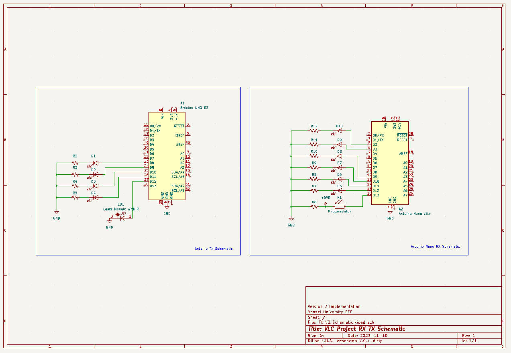

V2 VLC
- improved algorithm using 2 flashes instead of 3
- improved stability by pre-defining on times and cooldowns instead of having a time slice and dividing it according to number of bits

Current Implementation
- has header and tail buffers 
- goes to 1.3 seconds at 8 bits
- 100 ms on time
- 100 ms cooldowns

<b>Schematic:</b>
  

