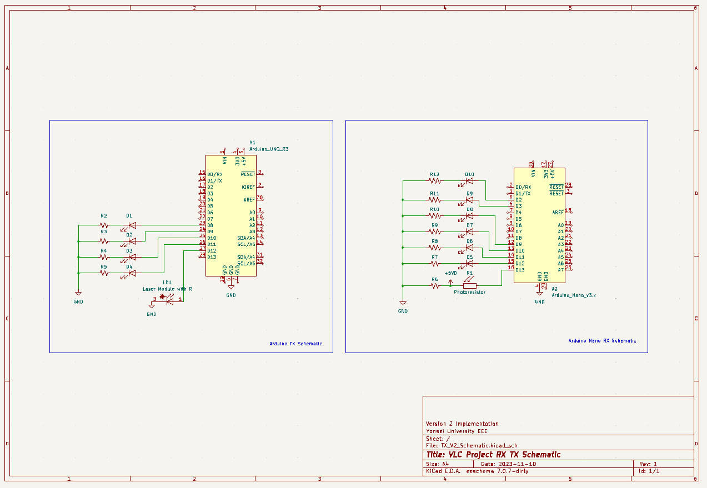

<h1> V3 VLC Implementation </h1>

<ol>16 bits in 2 seconds</ol>
<ol>VPPM TX done in 2 phases (8-bits per phase)</ol>

<h3> How is it implemented?</h3>
<p>
  The TX receives a single character code from the Serial interface. Using that char, an appropriate instruction is sent using a pre-defined dictionary. The function on the dictionary encodes the necessary information about the [opcode], [RS], [RD], and [data] about that instruction. 

  The TX sends the 16-bit instruction in two phases, one with the upper 8-bits and one with the lower 8-bits. The RX receives the instruction in the same way.

  The TX serial monitor shows all the necessary timing information and instruction breakdown. The transmitted instruction can be verified using the serial monitor of the RX device.

<br>
  <b>TODO:</b>
  <li>Finish all instruction set</li>
  <li>Implement ACK Protocol</li>
  <li>Add DEV3</li>
  <li>Add interference and re-routing protocol</li>
</p>
  
<br>
<b>Current Implementation</b>
<ol>has instruction set defined</ol>
<ol>goes to 2 seconds at 16 bits (confirmed and tested as of Nov 12, 2023)</ol>

<br><br>
<b>Instruction Set:</b>

```

opINV 0b000                 // do not use
opREAD 0b001                // reg read         --> [REG number]  [SELF ID] [DEV ID]    [001]
opACK 0b010                 // SEND ACK         --> [-0-]         [SELF ID] [MASTER ID] [010]
opACK_RELAY 0b011           // ACK is relayed   --> [#ID FROM]    [SELF ID] [MASTER ID] [011]
opLED_OFF 0b100             // LED OFF          --> [#LED NUMBER] [SELF ID] [DEV ID]    [100]
opCUSTOM 0b101              // Custom
opLED_ON 0b110              // LED ON           --> [#LED NUMBER] [SELF ID] [DEV ID]    [110] 
opCHAR 0b111                // send "character" --> [ASCII CODE]  [SELF ID] [DEV ID]    [111]

```

<br>
<b>Currently implemented TX instructions</b>

```

switch(incomingByte){  
      case '0': {TX_Commit(DEV1, MASTER, 0, opLED_ON); break;}
      case '1': {TX_Commit(DEV1, MASTER, 1, opLED_ON); break;}
      case '2': {TX_Commit(DEV1, MASTER, 2, opLED_ON); break;}
      case '3': {TX_Commit(DEV1, MASTER, 3, opLED_ON); break;}
      case '4': {TX_Commit(DEV1, MASTER, 4, opLED_ON); break;}
      case '5': {TX_Commit(DEV1, MASTER, 5, opLED_ON); break;}
      case '6': {TX_Commit(DEV1, MASTER, 6, opLED_ON); break;}
      case '7': {TX_Commit(DEV1, MASTER, 7, opLED_ON); break;}
      case '8': {TX_Commit(DEV1, MASTER, 8, opLED_ON); break;}
      case '9': {TX_Commit(DEV1, MASTER, 9, opLED_ON); break;}
      case 'a': {TX_Commit(DEV1, MASTER, 10, opLED_ON); break;}
      case 'b': {TX_Commit(DEV1, MASTER, 11, opLED_ON); break;}
      case 'c': {TX_Commit(DEV1, MASTER, 12, opLED_ON); break;}
      case 'd': {TX_Commit(DEV1, MASTER, 13, opLED_ON); break;}
      case 'e': {TX_Commit(DEV1, MASTER, 14, opLED_ON); break;}
      case 'f': {TX_Commit(DEV1, MASTER, 15, opLED_ON); break;}

      case 'q': {TX_Commit(DEV1, MASTER, 2, opLED_OFF); break;}        // Turn off BIT2 of DEV1 (under testing)
      
      case 'z': {TX_Commit(DEV1, MASTER, 255, opLED_ON); break;}      // LED open given 255 value for DT
      case 'p': {printConfig(); break;}                               // Print Configurations (no pulses)
      case 'x': {TX_Transmit(255); break;}                            // Raw send 255 using VPPM (1 phase only)

      default: ; // Do nothing for NULL string
    }

```

<br>
<b>Schematic:</b>
<br><br>

